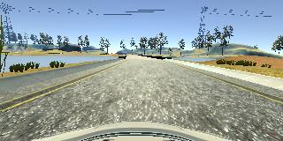
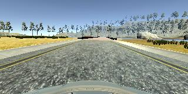
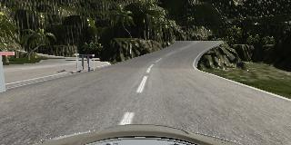

#**Behavioral Cloning**

**Behavioral Cloning Project**

The goals / steps of this project are the following:
* Use the simulator to collect data of good driving behavior
* Build, a convolution neural network in Keras that predicts steering angles from images
* Train and validate the model with a training and validation set
* Test that the model successfully drives around track one without leaving the road
* Summarize the results with a written report

## Rubric Points
### Here I will consider the [rubric points](https://review.udacity.com/#!/rubrics/432/view) individually and describe how I addressed each point in my implementation.  

---
### Files Submitted & Code Quality

#### 1. Submission includes all required files and can be used to run the simulator in autonomous mode

My project includes the following files:
* model.py containing the script to create and train the model
* drive.py for driving the car in autonomous mode
* model.h5 containing a trained convolution neural network
* writeup_report.md or writeup_report.pdf summarizing the results

#### 2. Submission includes functional code
Using the Udacity provided simulator and my drive.py file, the car can be driven autonomously around the track by executing
```sh
python drive.py model.h5
```

#### 3. Submission code is usable and readable

The model.py file contains the code for training and saving the convolution neural network. The file shows the pipeline I used for training and validating the model, and it contains comments to explain how the code works.

### Model Architecture and Training Strategy

#### 1. An appropriate model architecture has been employed

My model consists of a convolution neural network with 5x5 filter sizes and depth is 6.

The model includes RELU layers to introduce nonlinearity, and the data is normalized in the model using a Keras lambda layer.

#### 2. Attempts to reduce overfitting in the model

The model contains batch normalization and dropout layers in order to reduce overfitting.

The model was trained and validated on different data sets to ensure that the model was not overfitting. The model was tested by running it through the simulator and ensuring that the vehicle could stay on the track.

#### 3. Model parameter tuning

The model used an adam optimizer.
After some tries, the default initial learning rate 0.001 was the best.

#### 4. Appropriate training data

Training data was chosen to keep the vehicle driving on the road. I used a combination of center lane driving, recovering from the left and right sides of the road.

For details about how I created the training data, see the next section.

### Model Architecture and Training Strategy

#### 1. Solution Design Approach

The overall strategy for deriving a model architecture is end-to-end learning using neural network.

My first step was to use a convolution neural network model similar to the one in NVIDIA paper. I thought this model might be appropriate because it was tested in real car. However, since LeNet-based model has lower loss, it is used as the base for final model.

In order to gauge how well the model was working, I split my image and steering angle data into a training and validation set. I found that my first model had a low mean squared error on the training set but a high mean squared error on the validation set. This implied that the model was overfitting.

To combat the overfitting, I modified the model with Dropout and BatchNormalization so that the both loss are close enough.

Then I cut the image area because the area concern is not whole area.

The final step was to run the simulator to see how well the car was driving around track one. There were a few spots where the vehicle fell off the track. To improve the driving behavior in these cases, I increased training data by adding the reverse driving of course 1. Also, course 2 data is added for better generalization.

At the end of the process, the vehicle is able to drive autonomously around the track without leaving the road.

#### 2. Final Model Architecture

The final model architecture consisted of a convolution neural network with the following layers and layer sizes.

- Normalization to (-0.5, 0.5)
- Cropping(Cut top 70 and bottom 25)

- Convolution Layer(6 channels, 5x5 filter)
- Relu Activation
- BatchNormalization
- MaxPooling

- Convolution Layer(6 channels, 5x5 filter)
- Relu Activation
- BatchNormalization
- MaxPooling

- Flatten
- Dense(120)
- Dropout(keep probability: 0.5)
- Dense(84)
- Dropout(keep probability: 0.5)
- Dense(1)


#### 3. Creation of the Training Set & Training Process

To capture good driving behavior, I first recorded one lap on track one using center lane driving. Here is an example image of center lane driving:



I then recorded the driving at the reverse direction.



To augment the data sat, I also recored the driving from course 2.



After the collection process, I had 5328 data points for the center image. I then preprocessed the left and right image by adding bias to treat these as center image. This is the same technique used in NVIDIA paper.


I finally randomly shuffled the data set and put 30% of the data into a validation set.

I used this training data for training the model. The validation set helped determine if the model was over or under fitting. The ideal number of epochs was 5 because only training loss decreases after this epoch. I used an adam optimizer so that manually training the learning rate wasn't necessary.
